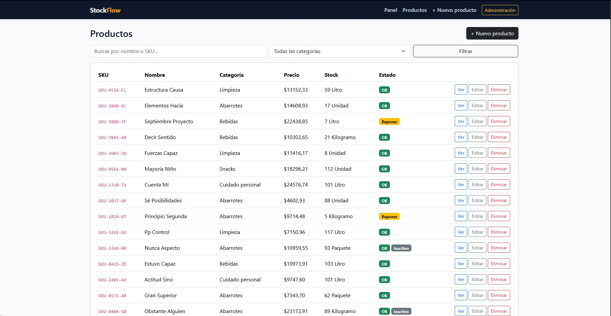
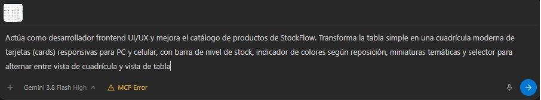
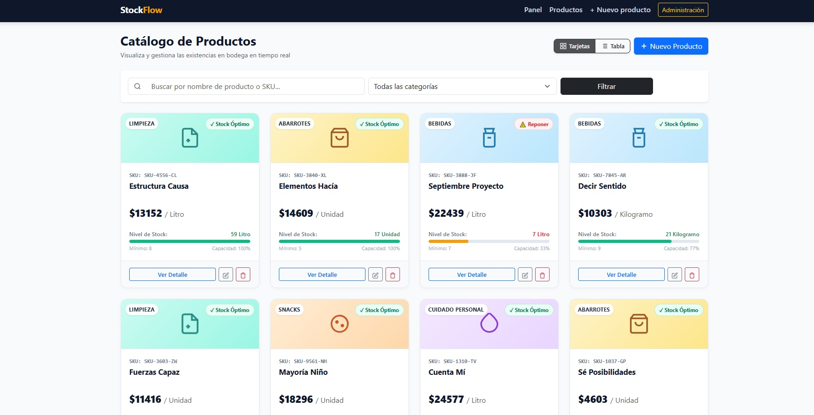

# StockFlow — Sistema de Gestión de Inventario para Comercios

> **Proyecto Académico:** Evaluación 1 — Desarrollo de aplicaciones del lado del servidor con Django e Inteligencia Artificial.  
> **Estudiante:** Víctor Aguilera  
> **Rúbrica de Evaluación:** Escala de Apreciación Django (12 Indicadores de Evaluación).

---

## 1. Descripción del Proyecto y Problemática del Negocio

**StockFlow** es una aplicación web del lado del servidor desarrollada con el framework **Django**. Nace como respuesta a una problemática común en minimarkets, tiendas de abarrotes y pequeños comercios: **el descontrol del inventario, la falta de alertas tempranas ante quiebres de stock y la pérdida de registro en los movimientos diarios de mercadería.**

A diferencia de un catálogo informativo estático, StockFlow procesa toda su lógica en el servidor:
- Realiza cálculos de valorización monetaria total del inventario en tiempo real.
- Controla el stock actual contrastándolo contra un umbral de stock mínimo para generar alertas inmediatas de reposición.
- Registra cada ingreso (reposición) o egreso (venta o merma) mediante un historial inmutable de movimientos, validando en el servidor que ninguna salida supere las existencias reales.

---

## 2. Bitácora de Desarrollo Paso a Paso (Diario de Trabajo)

A continuación detallo el proceso técnico que seguí para construir la aplicación desde cero:

### Paso 1 — Planificación de la arquitectura y entorno virtual
Inicié el proyecto aislando el entorno de desarrollo para evitar conflictos con librerías globales del sistema. Creé el entorno virtual e instalé Django junto con los paquetes externos requeridos:
```powershell
python -m venv venv
.\venv\Scripts\Activate.ps1
```

### Paso 2 — Selección y justificación de paquetes externos (Indicador 3)
Para cumplir con el indicador de paquetes externos de terceros, seleccioné e instalé las siguientes herramientas en `requirements.txt`:
1. **`faker`:** Permite generar datos sintéticos y realistas en español para simular una bodega operativa sin recurrir a datos manuales inventados.
2. **`django-crispy-forms` y `crispy-bootstrap5`:** Permiten renderizar formularios con los estilos oficiales de Bootstrap 5 de manera modular y limpia, reduciendo el código repetitivo en las plantillas.

### Paso 3 — Creación del proyecto y la aplicación
Inicialicé el proyecto base `stockflow` y la aplicación modular de negocio `inventario`:
```powershell
django-admin startproject stockflow .
python manage.py startapp inventario
```
En `stockflow/settings.py` registré la app `inventario.apps.InventarioConfig` y los paquetes `crispy_forms` y `crispy_bootstrap5`. También configuré el idioma en español (`LANGUAGE_CODE = 'es'`) y la zona horaria de Chile (`TIME_ZONE = 'America/Santiago'`).

### Paso 4 — Modelado relacional con reglas de negocio (Indicador 1 y 7)
En `inventario/models.py` definí 3 entidades fuertemente vinculadas:
- **`Categoria`:** Agrupa los productos (ej: Abarrotes, Bebidas, Limpieza). Cuenta con una propiedad calculada `total_productos` que ejecuta una consulta inversa de conteo sobre el ORM.
- **`Producto`:** Contiene nombre, código `sku` con restricción `unique=True`, precio unitario en `DecimalField` (para garantizar exactitud financiera), stock actual y stock mínimo.
  - **Decisión de diseño clave:** Relacioné `Producto` con `Categoria` mediante `ForeignKey` con `on_delete=models.PROTECT`. Esto impide que un usuario borre accidentalmente una categoría que aún contenga productos asignados, evitando registros huérfanos.
  - **Operación aritmética:** La propiedad `valor_inventario` calcula en el servidor `self.precio * self.stock`.
  - **Operación de comparación:** La propiedad `necesita_reposicion` evalúa `self.stock <= self.stock_minimo`.
- **`MovimientoStock`:** Registra cada transacción de `ENTRADA` o `SALIDA`. Se relaciona con `Producto` mediante `ForeignKey` con `on_delete=models.CASCADE`, de modo que si un producto se descataloga, su historial se suprime de forma coherente.

### Paso 5 — Migraciones y base de datos relacional (Indicador 6)
Generé los archivos de migración iniciales y creé la estructura de tablas en SQLite:
```powershell
python manage.py makemigrations inventario
python manage.py migrate
```

### Paso 6 — Generación de datos de prueba asistida por IA (Indicador 11)
Para no poblar la base de datos a mano, creé el comando personalizado `inventario/management/commands/seed_datos.py`. Con la asistencia de la IA, configuré `Faker` en español (`es_ES`) para generar 5 categorías comerciales, 20 productos con códigos SKU realistas y un historial de entre 1 y 4 movimientos por producto:
```powershell
python manage.py seed_datos --limpiar
```

### Paso 7 — Personalización del Panel de Administración
En `inventario/admin.py` registré los modelos utilizando decoradores `@admin.register`:
- Personalicé los títulos oficiales: `admin.site.site_header = "StockFlow — Panel de Inventario"`.
- En `ProductoAdmin` configuré `list_display`, filtros laterales por categoría y estado activo (`list_filter`), barra de búsqueda por nombre o SKU (`search_fields`) y paginación a 15 elementos (`list_per_page = 15`).
- Implementé `MovimientoStockInline` para inspeccionar el historial de movimientos directamente dentro de la ficha de cada producto.

### Paso 8 — Archivos estáticos, Favicon y Arquitectura MVT (Indicador 5 y 8)
Configuré `STATICFILES_DIRS = [BASE_DIR / 'static']` en `settings.py` y agregué una redirección permanente en `urls.py` hacia `/static/img/favicon.ico`, evitando errores 404 en el log de Django. Diseñé una hoja de estilos propia en `static/css/styles.css` con acentos de color ámbar y tarjetas con sombras suaves, manteniendo Bootstrap 5 como base.

### Paso 9 — Vistas del controlador, filtros con operadores Q y formularios
En `inventario/views.py` implementé la lógica del lado del servidor:
- **`dashboard`:** Calcula la métrica total de productos, unidades acumuladas, valor monetario global y lista de alertas de reposición antes de enviar los datos a la plantilla.
- **`lista_productos`:** Implementa búsqueda por texto usando `Q(nombre__icontains=query) | Q(sku__icontains=query)` combinado con filtros por categoría.
- **`detalle_producto`:** Procesa formularios `POST` para registrar entradas o salidas de stock, actualizando automáticamente las unidades del producto en la base de datos.
- **Validación en servidor:** En `inventario/forms.py` (`MovimientoForm.clean()`), el servidor rechaza cualquier solicitud de salida cuya cantidad supere las existencias físicas disponibles.

### Paso 10 — Pruebas unitarias automatizadas y verificación
Para comprobar el correcto funcionamiento de toda la aplicación, ejecuté la suite de pruebas unitarias en `inventario/tests.py`:
```powershell
python manage.py test
```
**Resultado:** 15 pruebas exitosas (0 fallos y 0 errores) en 0.32 segundos, validando modelos, formularios, vistas GET/POST y reglas de eliminación.

---

## 3. Matriz de Evidencias de los 12 Indicadores (Evaluación 1)

| # | Indicador de la Rúbrica | Evidencia Concreta en el Código de StockFlow |
|---|---|---|
| **1** | Variables y operaciones | `inventario/models.py`: variables de clase, `DecimalField`, aritmética en `valor_inventario` (`precio * stock`), comparación en `necesita_reposicion` (`stock <= stock_minimo`). |
| **2** | Instrucciones, estructuras y operadores | `inventario/views.py`: condicional doble en `detalle_producto` (evalúa si es entrada o salida), operadores lógicos `Q` con OR para búsqueda; validación `clean()` en `forms.py`. |
| **3** | Paquetes externos | `requirements.txt`: librería `Faker` para datos de prueba y `django-crispy-forms` + `crispy-bootstrap5` para formularios. |
| **4** | Aplicación sencilla en Django | Proyecto completo funcional, sin errores en `manage.py check`, con panel de métricas, catálogo, detalle y formularios. |
| **5** | Modelo MVC (MTV en Django) | Estricta separación: Modelo en `models.py`, Vista en `templates/`, Controlador en `views.py` y `urls.py`. |
| **6** | Configuración del entorno | `venv/`, `settings.py` con idioma español, zona horaria de Chile, configuración de SQLite y mapeo de `static/`. |
| **7** | Django Models con relaciones | Relaciones 1 a N con clave foránea: `Categoria -> Producto` (`on_delete=PROTECT`) y `Producto -> MovimientoStock` (`on_delete=CASCADE`). |
| **8** | Vistas y templates integrados | Plantilla maestra `base.html` con herencia de bloques, ``, `` y renderizado dinámico de contexto. |
| **9** | Tecnologías del lado del servidor | Lógica ejecutada en Python: validación contra stock negativo en `clean()`, cálculo de inventario con ORM y sesiones con mensajes flash. |
| **10** | Uso de IA como apoyo técnico | Documentación de prompts a la IA, análisis crítico de su propuesta, adaptación al modelo chileno y capturas en carpeta `evidencias/`. |
| **11** | Generación y uso de datos de prueba | Comando `seed_datos.py` que emplea `Faker` bajo estructura de IA para poblar 5 categorías y 20 productos con movimientos. |
| **12** | Protocolos, hosting y dominios | Documentación detallada sobre HTTP/HTTPS, WSGI (Gunicorn), proveedores de hosting y gestión de DNS en NIC Chile. |

---

## 4. Uso de Inteligencia Artificial y Evidencias Visuales (Indicador 10 y 11)

Como parte de las exigencias del **Indicador 10**, utilicé herramientas de Inteligencia Artificial (Gemini 3.8) como copiloto de desarrollo, aplicando un proceso de **auditoría humana crítica**: no se copió el código ciegamente, sino que se adaptó al modelo de negocio de una tienda física y a las convenciones de Django.

### Evidencias del Proceso de Intervención con IA

#### 1. Estado Inicial — Catálogo en formato tabla tradicional
En la primera etapa, el catálogo de productos se mostraba como una tabla simple de texto con botones básicos:


#### 2. Formulación del Prompt a la IA
Instrucción entregada al asistente de IA para rediseñar la interfaz y optimizar la experiencia visual del catálogo de bodega:


#### 3. Resultado Final — Interfaz optimizada y responsiva
Resultado tras incorporar las recomendaciones de la IA, auditoría de código e integración de componentes visuales adaptados a computadores y teléfonos móviles:


---

## 5. Arquitectura de Red, Protocolos, Hosting y Dominios (Indicador 12)

Para defender el **Indicador 12** ante el evaluador, se describe cómo opera la solución en red y su estrategia de puesta en producción:

- **Protocolo de Comunicación (HTTP vs. HTTPS):**
  - En entorno de desarrollo, el servidor local `runserver` responde peticiones **HTTP** no cifradas en `127.0.0.1:8000`. El navegador envía métodos `GET` (para consultar vistas) y `POST` (para enviar formularios con token `CSRF`).
  - En un entorno de producción real, el tráfico debe circular obligatoriamente bajo **HTTPS** (puerto 443), empleando certificados TLS/SSL (como los emitidos por Let's Encrypt) para cifrar los datos en tránsito.
- **Servidor de Producción y WSGI:**
  - El servidor integrado `manage.py runserver` es exclusivo para pruebas.
  - En producción, la aplicación se ejecuta mediante un servidor WSGI como **Gunicorn** o **uWSGI**, el cual se comunica con el punto de entrada oficial definido en `stockflow/wsgi.py`. Gunicorn se sitúa detrás de un servidor web inverso como **Nginx**, encargado de servir los archivos estáticos y gestionar las conexiones entrantes.
- **Opciones de Hosting:**
  - **PaaS (Plataforma como Servicio):** Opciones recomendadas para Django como **Render**, **Railway** o **PythonAnywhere**, que automatizan la integración continua desde repositorios Git.
  - **IaaS (Infraestructura como Servicio):** Un VPS en **DigitalOcean** o **AWS EC2**, configurando Ubuntu Linux, Nginx, Gunicorn y una base de datos PostgreSQL gestionada.
- **Nombre de Dominio y DNS:**
  - Se adquiere un nombre de dominio local como `stockflow.cl` a través de **NIC Chile**.
  - En el panel DNS del registrador se crean los registros necesarios:
    - **Registro A:** Apunta el dominio raíz (`stockflow.cl`) a la dirección IP pública del servidor.
    - **Registro CNAME:** Apunta el subdominio (`www.stockflow.cl`) hacia el dominio principal o el alias provisto por la plataforma de hosting.

---

## 6. Cómo Ejecutar el Proyecto Localmente

### Requisitos Previos
- Python 3.11 o superior instalado.

### Pasos de Ejecución en Windows (PowerShell)

```powershell
# 1. Clonar o ingresar a la carpeta del proyecto
cd web-basica

# 2. Crear y activar el entorno virtual
python -m venv venv
.\venv\Scripts\Activate.ps1

# 3. Instalar las dependencias del proyecto
pip install -r requirements.txt

# 4. Aplicar las migraciones de base de datos
python manage.py migrate

# 5. Poblar la base de datos con datos de prueba realistas (Faker)
python manage.py seed_datos --limpiar

# 6. Ejecutar las pruebas unitarias automatizadas
python manage.py test

# 7. Iniciar el servidor local de desarrollo
python manage.py runserver
```

Una vez iniciado el servidor, abrir en el navegador:
- **Panel Principal:** [http://127.0.0.1:8000/](http://127.0.0.1:8000/)
- **Catálogo de Productos:** [http://127.0.0.1:8000/productos/](http://127.0.0.1:8000/productos/)
- **Panel Administrativo de Django:** [http://127.0.0.1:8000/admin/](http://127.0.0.1:8000/admin/)
  *(Superusuario inicial: `admin` / Contraseña: `admin1234`)*
